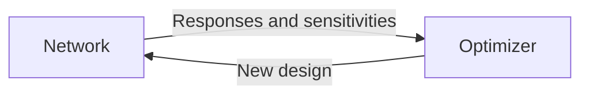
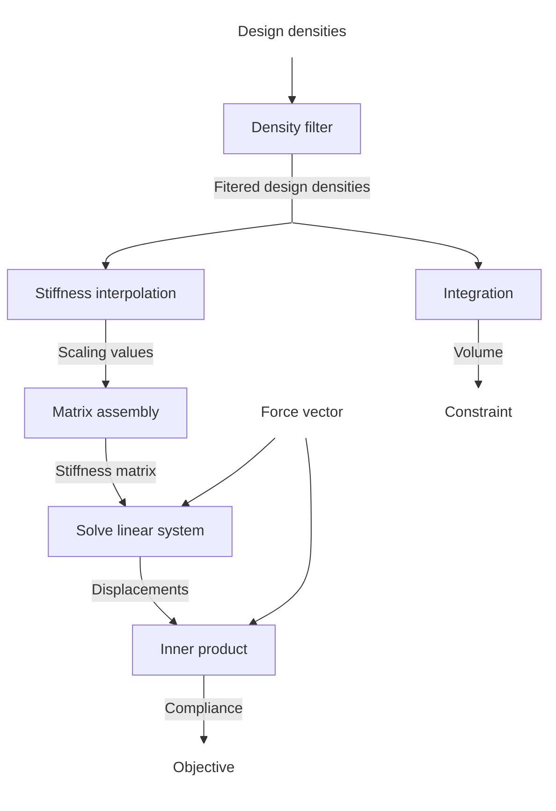
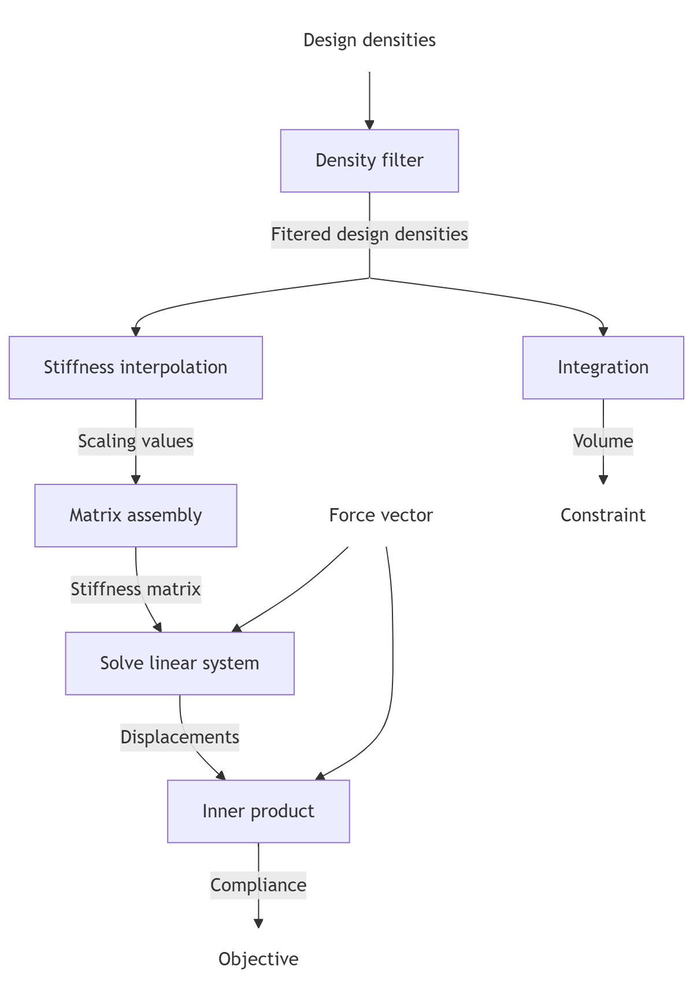
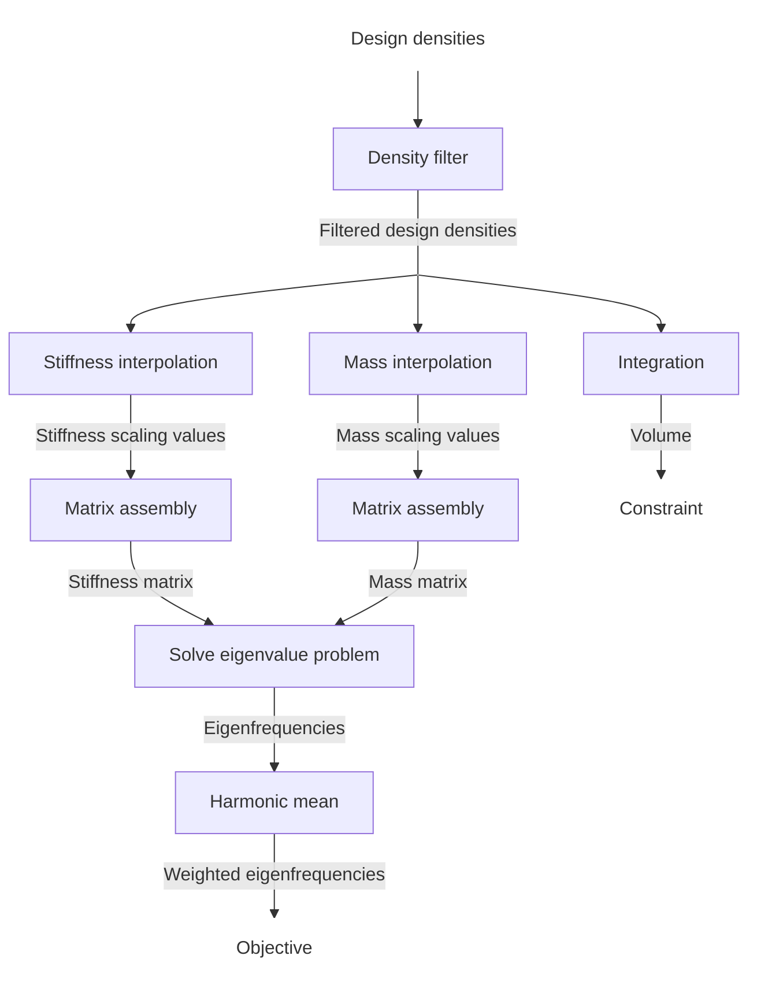
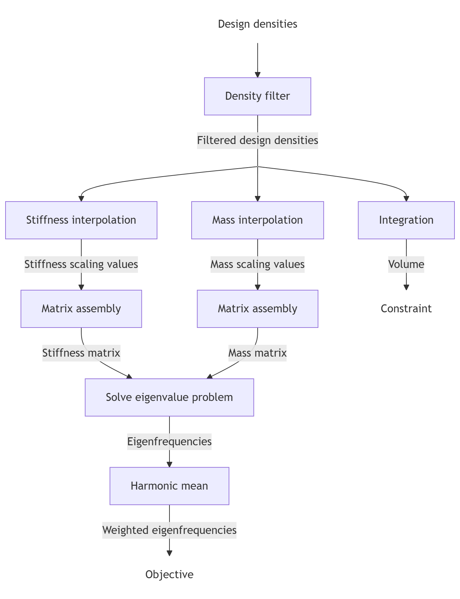

## Summary
Topology optimization (also known as *generative design*) has become an increasingly valuable tool in various engineering disciplines. Its goal is to solve the inverse problem of optimal material distribution within a 2D or 3D domain to achieve components with enhanced performance — such as reduced mass, increased or decreased stiffness (as in compliant mechanisms), tailored thermal conductivity, or favorable dynamic properties. These  problems typically involve a very high number of design variables —ranging from millions to even billions — posing significant computational challenges.

At the core of topology optimization are *gradient-based* optimization methods. Because performance evaluation of each design iteration requires solution of a finite-element simulation, leveraging gradient information is essential to keep the computational effort tractable. However, deriving and implementing gradients (or *design sensitivities*) can be complex, time-consuming, and prone to errors. This is where `pyMOTO` provides a powerful solution.

. Output of the optimization is post-processed with Paraview to generate this image and can also be used to generate an STL file.\label{fig:3D_stiffness}](figs/stiffness_optimized.png)

## What does `pymoto` offer?
The python package `pymoto` offers a  flexible and modular framework for construction of topology optimization problems. Using a curated set of generic building blocks (called `Module`s), users can easily assemble a wide variety of density-based topology optimization problems. Sensitivities are computed automatically by the framework using backpropagation, eliminating the need for manual gradient derivation.

The framework is easily __extendable__ with custom modules, for which the user can implement their own functionality (and partial sensitivity implementation) or link external tools if desired. These can be linked to other modules, while the (semi-)automatic differentiation engine takes care of the sensitivities of interconnected network of modules. The architecture of the code itself is focused on reconfigurability, ease of use, and being lightweight, while still being computationally efficient enough to perform 3D optimization (see \autoref{fig:3D_stiffness,fig:3D_thermal} for an optimized example).

Currently implemented in `pymoto` are the following key features:
- Core engine for semi-automatic differentiation and reconfigurability
- Library of building blocks (modules) for a wide variety of topology optimization problems
	- Static and dynamic structural mechanics
	- Compliant mechanisms
	- Stress constraints
	- Heat transfer and thermo-mechanic coupling
	- Density filtering, robust formulations
	- Overhang filter for additive manufacturing
	- General math expressions, linear algebra operations, linear- and eigen-solvers
	- General voxel-based finite element matrix assembly
	- For more, see the [examples gallery](https://pymoto.readthedocs.io/en/latest/auto_examples/index.html#examples-topology-optimization)
- Collection of solvers for linear systems of equations for dense and sparse matrices, both direct and iterative. Includes multigrid preconditioning with conjugate-gradient solver enabling 3D topology optimization
- Several optimizers suited for topology optimization (OC, MMA, GCMMA)
- Finite-difference tools for checking sensitivity implementation

. Post-processing is done with Paraview.\label{fig:3D_thermal}](figs/thermal_optimized.png)

## Statement of need
#### State of the field
Currently, there are several open source projects available to users who want to perform topology optimization. Also commercial software exist, but these are considered out of scope as they are generally black-box and not extendable with custom user functionality.

The main bulk of topology optimization software are *single-purpose academic demonstration software*, usually linked to a scientific publication. Examples of this are the 99-line code written in Matlab [@Sigmund2001], or the version in C++ with PETSc [@Aage2015]. These are useful to understand the theory behind topology optimization, but can hardly be called a software *library* or *framework*. For an overview of these types of code, see [@Wang2023].

Several tools use *automatic differentiation* (AD) to calculate gradient information , such as AuTO, which uses `jax` [@Chandrasekhar2021], or the Julia framework `Topopt.jl` [@Tarek2019]. However, these software are either unmaintained and/or are very limited in functionality in comparison to `pymoto`. In general, AD is very flexible to use, but its computational performance and memory usage remain topic of active research [@Norgaard2017], [@Boudaoud2025], [@Sanu2026]. In `pymoto`, AD is also supported (currently with `jax` or HIPS `autograd`), where a user-defined function can be passed to the [AD `Module`](https://pymoto.readthedocs.io/en/latest/stubs/pymoto.AutoMod.html). Note that `pymoto` itself could be categorized as a coarse-grained type of automatic differentiation (or rather semi-automatic differentiation).

OpenMDAO [@Gray2019] is an open source general multi-disciplinary optimization software written in Python, which implements extended semi-automatic differentiation functionalities, some similar to `pymoto`. This software is mainly focused on multi-disciplinary analysis and optimization with coupled dependencies but no topology optimization functionalities are implemented. [@Chung2019] provides an example implementation of topology optimization using OpenMDAO.

Besides density-based topology optimization, software also exists for other types of topology optimization. For instance, [@OpenPisco] is a Python library focused on level-set topology optimization, but is not based on (semi-)automatic differentiation methods like in `pymoto`. 

#### Target users and use-cases
A broad range of users may benefit from using `pymoto`. On the one hand, there are users that want to generate *designs or components* with enhanced optimized performance, for instance students, (3D printing) hobbyists, industrial users making mechanical components, or researchers in a topic that benefits optimized designs. On the other hand, there are students or researchers that focus on the topology optimization *itself*, whether it be to learn the ropes or experimenting with optimization formulations and new functionalities (for the purpose of improving the former use-case).

Besides the topology optimization itself, users may also benefit from:
 - Rapid development and testing of topology optimization formulations, without constantly having to (re-)implement sensitivities
 - Foundation for extensions targeting specific applications (and user-specific code base)
 - Defined structure and interface that allows easy sharing of modules containing new formulations between parties without sharing entire code-base
 
Already several academic research papers make use of the `pyMOTO` library, of which some bordering industrial applications. 
    - Peak paper [@Delissen2020]
    - Nyquist paper [@Delissen2023]
    - Addma paper (industry) [@Delissen2022]
    - Enclosed void joran [@Zwet2023]
    - Overhang joran student
    - Marek paper
    - Joran paper
    - Stijn papers?

## Optimization structure and examples
Any optimization in the `pyMOTO` framework follows the same structure as in \autoref{fig:optimization_loop}. The problem one wants to optimize is defined in the `Network`, which is a functor providing forward response calculation (e.g. mass and stiffness) as well as backpropagation functionality for calculation of the sensitivities of relevant response values. The optimization algorithm iteratively updates the design after which it is evaluated using the `Network`, providing new responses and sensitivities with which the optimizer can update the design again.

Inside the defined `Network`, several modules are linked together to construct the desired optimization problem, for which two examples are provided below. 

#### Compliance minimization
The structure inside a `Network` of the classic compliance minimization problem [@Bendsoe1989] is schematically shown in \autoref{fig:stiffness_network}, with each box being a `Module` in `pyMOTO`. A code example implementing this optimization problem can be found in the [pyMOTO documentation (compliance minimization)](https://pymoto.readthedocs.io/en/latest/auto_examples/topology_optimization/ex_compliance.html).

#### Eigenfrequency maximization
Another classic optimization problem is eigenfrequency maximization [@Ma1995]. This can quite easily be seen as an extension of the compliance minimization example, where the calculation of the mass matrix is added and the eigenvalue problem is solved instead of solving a linear system of equations, as is schematically shown in \autoref{fig:eigenfrequency_network}. The code for this example can be found again in the [pyMOTO documentation (eigenfrequency maximization)](https://pymoto.readthedocs.io/en/latest/auto_examples/topology_optimization/ex_eigenfrequency.html) .

These examples demonstrate the potential for reconfigurability and show that only a limited set of `pyMOTO` modules are required to construct various optimization problems. For more examples, the reader is referred to the [examples gallery of the `pyMOTO` documentation](https://pymoto.readthedocs.io/en/latest/auto_examples/index.html#examples-topology-optimization) and [@Delissen2022].

# Acknowledgements
...

# AI usage disclosure
No generative AI tools were used in the development of this software, the writing
of this manuscript, or the preparation of supporting materials.

# References